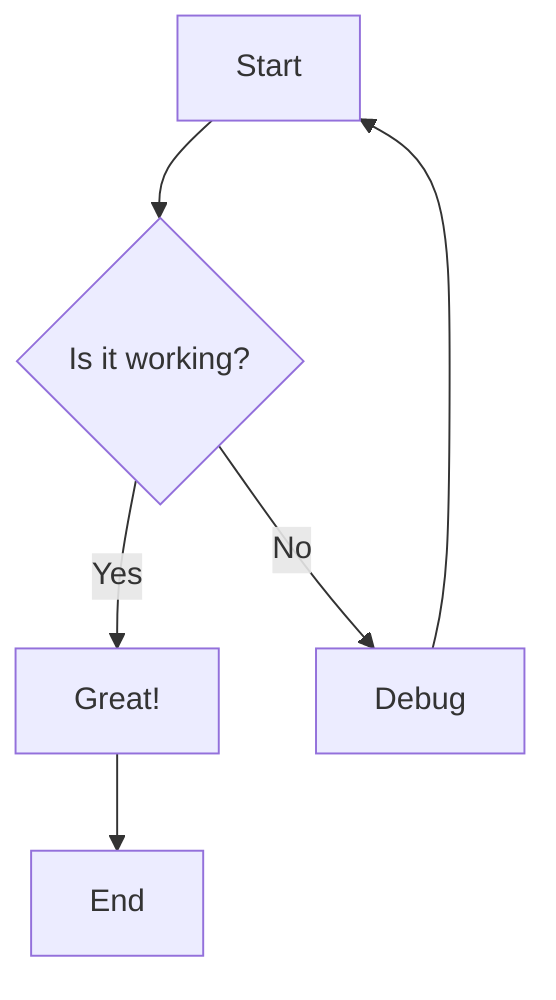
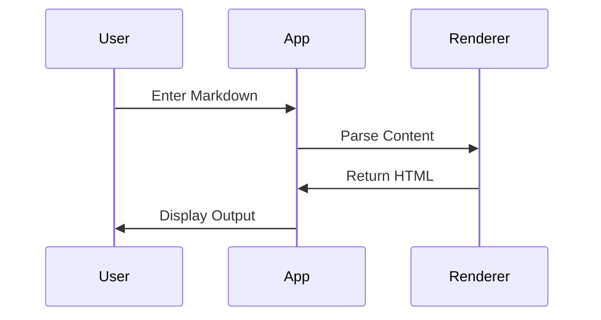
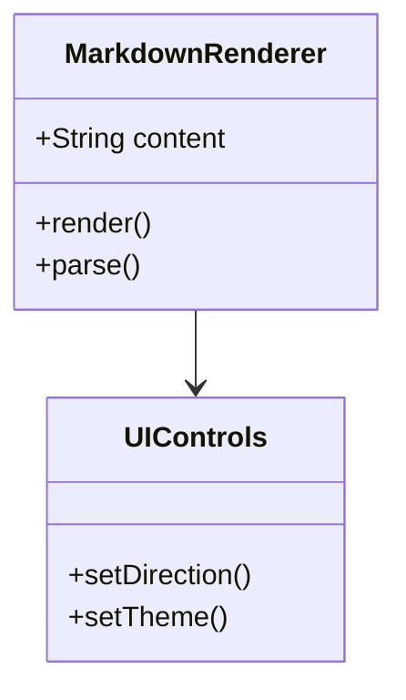
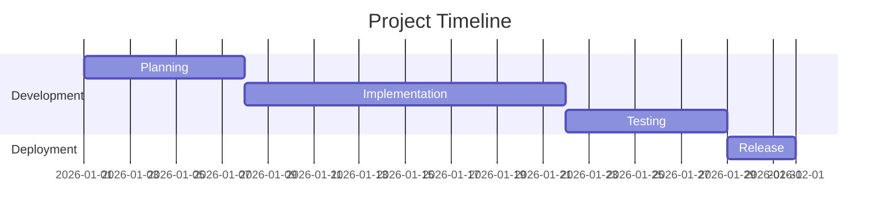
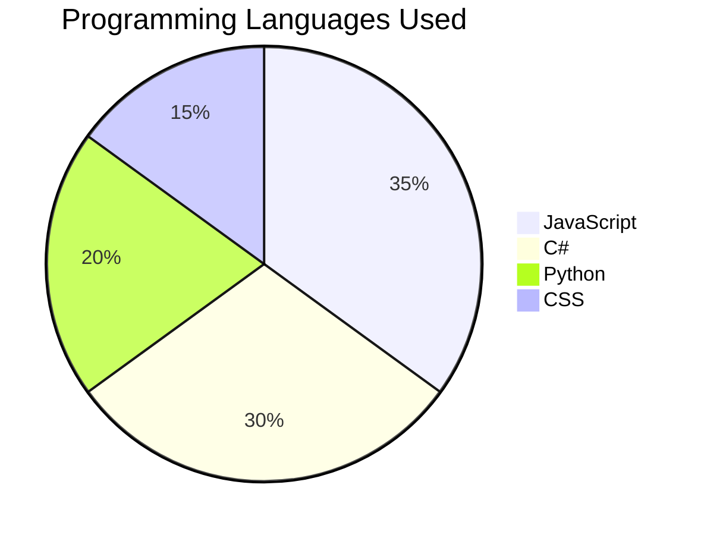

# Markdown Renderer Test Document

Welcome to the **complete** markdown test! This document tests *all* markdown features.

## Text Formatting

### Basic Styling
- **Bold text** using double asterisks
- *Italic text* using single asterisks
- ***Bold and italic*** using triple asterisks
- ~~Strikethrough~~ using double tildes
- `inline code` using backticks

### Lists

#### Unordered List
- First item
- Second item
  - Nested item (if supported)
- Third item

#### Ordered List
1. First step
2. Second step
3. Third step

#### Task List
- [x] Completed task
- [ ] Pending task
- [ ] Another pending task

## Links and Images

### Links
[Visit GitHub](https://github.com)
[Visit Google](https://google.com)

### Images (placeholder)


## Code Blocks

### JavaScript
```javascript
function greet(name) {
    console.log(`Hello, ${name}!`);
    return `Welcome to Markdown Renderer`;
}

greet("World");
```

### Python
```python
def calculate_sum(a, b):
    result = a + b
    print(f"Sum: {result}")
    return result

calculate_sum(10, 20)
```

### C# (for testing your language preference)
```csharp
public class Program
{
    public static void Main()
    {
        Console.WriteLine("Hello from C#!");
        var numbers = new List<int> { 1, 2, 3, 4, 5 };
        var sum = numbers.Sum();
        Console.WriteLine($"Sum: {sum}");
    }
}
```

## Tables

| Feature | Status | Priority |
|---------|--------|----------|
| Text Formatting | ✅ Working | High |
| Code Blocks | ✅ Working | High |
| Tables | ✅ Working | Medium |
| Mermaid | 🔄 Testing | High |
| PDF Export | 🔄 Testing | Medium |

## Blockquotes

> This is a blockquote.
> It can span multiple lines.
> 
> > Nested blockquotes are also possible!

## Horizontal Rules

---

## Special Characters & Emojis

Testing special characters: & < > " ' 
Testing emojis: 😀 🚀 💻 ⭐ ❤️ 📝 ✅

## Mermaid Diagrams

### Flowchart


### Sequence Diagram


### Class Diagram


### Gantt Chart


### Pie Chart


## RTL Text Testing (Right-to-Left)

### Arabic Text
مرحبا بك في اختبار اللغة العربية. هذا النص يجب أن يظهر من اليمين إلى اليسار.

### Hebrew Text
שלום! זה טקסט בעברית לבדיקת התמיכה ב-RTL.

### Persian Text
سلام! این متن فارسی برای تست جهت راست به چپ است.

## Mixed Content (LTR + RTL)

This is English text with some العربية mixed in, and then back to English.

## Mathematical Expressions (if supported)

Inline math: The formula is x² + y² = z²

Block math:
E = mc²

## Long Content Test

Lorem ipsum dolor sit amet, consectetur adipiscing elit. Sed do eiusmod tempor incididunt ut labore et dolore magna aliqua. Ut enim ad minim veniam, quis nostrud exercitation ullamco laboris nisi ut aliquip ex ea commodo consequat.

Duis aute irure dolor in reprehenderit in voluptate velit esse cillum dolore eu fugiat nulla pariatur. Excepteur sint occaecat cupidatat non proident, sunt in culpa qui officia deserunt mollit anim id est laborum.

### Subsection with More Text

Sed ut perspiciatis unde omnis iste natus error sit voluptatem accusantium doloremque laudantium, totam rem aperiam, eaque ipsa quae ab illo inventore veritatis et quasi architecto beatae vitae dicta sunt explicabo.

## Icon Test (Font Awesome)

If Font Awesome is loaded correctly, you should see these icons:
- Home: 🏠 (or <i class="fas fa-home"></i> if rendered as HTML)
- Heart: ❤️ (or <i class="fas fa-heart"></i> if rendered as HTML)
- Star: ⭐ (or <i class="fas fa-star"></i> if rendered as HTML)

---

## Footer

**Test completed!** If you can see all the sections above with proper formatting, icons, tables, code blocks, and Mermaid diagrams, then your Markdown Renderer is working perfectly! 🎉

Last updated: February 12, 2026
